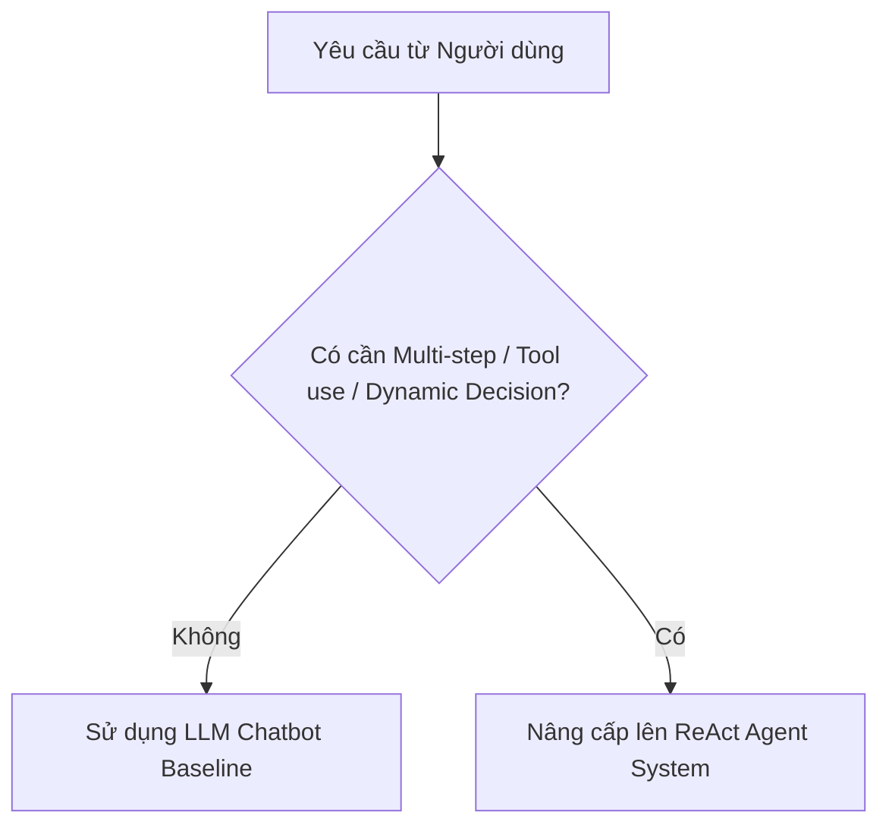
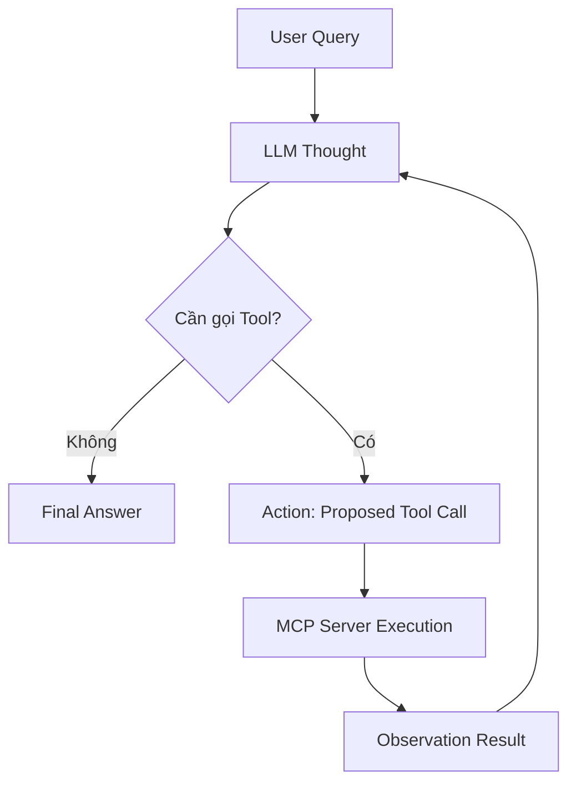

# 🎓 BÀI LAB 3: CHATBOT VS REACT AGENT — TỪ LÝ THUYẾT ĐẾN THỰC THI (MCP ENHANCED)

Bài thực hành giúp học viên chuyển đổi tư duy từ viết Chatbot đơn thuần sang phát triển hệ thống **ReAct Agent** thông minh, ứng dụng giao thức **Model Context Protocol (MCP)** để kết nối dữ liệu và công cụ thực tế.

> 💡 **Mục tiêu đầu ra của Bài Lab:**  
> Sau khi hoàn thành bài Lab 180 phút, học viên sẽ nộp một sản phẩm cá nhân hoàn chỉnh: mã nguồn Agent chạy mượt mà ReAct Loop & Native Tool Calling, kết nối MCP Server và trích xuất file Waterfall Trace Log chuẩn hóa.

📦 **Starter Repositories Bài Lab 3 (Fork về làm bài):**

- ☀️ **Lớp Sáng (K4A):** [VinUni-AI20k/K4A-Day03-Lab-Chatbot-vs-ReAct-Agent-MCP](https://github.com/VinUni-AI20k/K4A-Day03-Lab-Chatbot-vs-ReAct-Agent-MCP)  
- 🌙 **Lớp Chiều (K4B):** [VinUni-AI20k/K4B-Day03-Lab-Chatbot-vs-ReAct-Agent-MCP](https://github.com/VinUni-AI20k/K4B-Day03-Lab-Chatbot-vs-ReAct-Agent-MCP)

---

## 📋 THÔNG TIN BRIEF & BỐI CẢNH LÝ THUYẾT

- **Mục tiêu:** Xây dựng ReAct Agent kết nối MCP Server, thực thi vòng lặp suy luận Thought -> Action -> Observation và xuất vết Waterfall Trace Log.
- **Người học / Day / Thời lượng:** Học viên Khóa 4 / Ngày 03 / 180 phút làm bài (Buổi học 240 phút - 4 tiếng).
- **Link nguồn Starter Repos:**  
  - Lớp Sáng (K4A): `https://github.com/VinUni-AI20k/K4A-Day03-Lab-Chatbot-vs-ReAct-Agent-MCP`  
  - Lớp Chiều (K4B): `https://github.com/VinUni-AI20k/K4B-Day03-Lab-Chatbot-vs-ReAct-Agent-MCP`
- **Hình thức:** Cá nhân làm bài 100% (`workMode: "individual"`).
- **Deliverable và cách kiểm tra:** Fork repo đúng ca học về GitHub cá nhân (Lớp Sáng: `K4A-DAY03-HoVaTen-MSSV` | Lớp Chiều: `K4B-DAY03-HoVaTen-MSSV`). Kiểm tra qua file log `docs/trace_waterfall.json` và mã nguồn Python `src/`.

### 💡 Khung Nền tảng Lý thuyết (4 Cấp độ AI System)

Nội dung bài Lab bám sát 100% Khung lý thuyết trong **Slide Day 3 (`day03-tu-chatbot-den-agentic-agent-react.pdf`)**:

| Cấp độ    | Loại hệ thống                  | Đặc điểm kỹ thuật cốt lõi                         | Sự xuất hiện trong Bài Lab                    |
| --------- | ------------------------------ | ------------------------------------------------- | --------------------------------------------- |
| **Cấp 1** | **Rule-Based Bot**             | Khớp từ khóa `if/else` cố định, không có LLM      | `src/ai_levels/level1_rule_based.py`          |
| **Cấp 2** | **LLM Chatbot**                | Dùng LLM sinh text mượt, không gọi được Tool      | **Chatbot Baseline** (`run_baseline_chatbot`) |
| **Cấp 3** | **ReAct Agent (MCP-Enhanced)** | Vòng lặp ReAct `Thought -> Action -> Observation` | **ReAct Agent** (Trọng tâm Bài Lab)           |
| **Cấp 4** | **Autonomous Agent**           | Tự rã mục tiêu (Planning), tự học & có Memory     | 🎁 **Phần Mở rộng Tham khảo**                 |

---

## 1. CHUẨN BỊ MÔI TRƯỜNG & FORK REPO (ĐA NỀN TẢNG)

Mỗi học viên tự làm việc trên môi trường máy tính của mình. Thực hiện theo đúng thứ tự các bước:

### Bước 1: Fork và Clone Repo

1. Mở trang Starter Repo GitHub và nhấn nút **Fork** về tài khoản cá nhân.
2. Đổi tên Repository theo chuẩn:
  📌 **`K4-DAY03-HoVaTen-MSSV`** *(Ví dụ: `K4-DAY03-NguyenVanA-SV2026001`)*
3. Clone Repo vừa fork về máy tính và mở bằng VSCode / IDE:
  ```bash
   git clone https://github.com/<tai_khoan_cua_ban>/K4-DAY03-HoVaTen-MSSV.git
  ```

### Bước 2: Tạo Môi trường ảo (Virtualenv) & Cài đặt Thư viện

> 🐍 **Yêu cầu môi trường Python:** **Python 3.10 – 3.12** *(Tránh Python 3.9 do thiếu type hinting hiện đại và Python 3.13 do nhiều thư viện AI chưa hỗ trợ pre-built wheel)*.

**Trên macOS / Linux / Bash / Zsh:**

```bash
python3 -m venv .venv
source .venv/bin/activate
pip install -r requirements.txt
cp .env.example .env
cp config/test_cases.example.json config/test_cases.json
```

**Trên Windows (PowerShell):**

```powershell
python -m venv .venv
.venv\Scripts\Activate.ps1
pip install -r requirements.txt
Copy-Item .env.example .env
Copy-Item config\test_cases.example.json config\test_cases.json
```

*(Nếu PowerShell chặn Script, chạy lệnh: `Set-ExecutionPolicy -ExecutionPolicy RemoteSigned -Scope CurrentUser`)*

**Trên Windows (Command Prompt - CMD):**

```cmd
python -m venv .venv
.venv\Scripts\activate.bat
pip install -r requirements.txt
copy .env.example .env
copy config\test_cases.example.json config\test_cases.json
```

- [x] Đã Fork thành công Repo về GitHub cá nhân với tiền tố `K4-DAY03-`.
- [x] Đã kích hoạt môi trường ảo `(.venv)` và cài đặt thành công thư viện từ `requirements.txt`.
- [x] Đã tạo file `config/test_cases.json` từ `config/test_cases.example.json`.

---

## 2. TASK 1.1 — ĐÁNH GIÁ 4 TIÊU CHÍ AGENTIC FIT

### Vì sao cần đánh giá Agentic Fit trước khi viết Code?

Không phải mọi bài toán đều cần đến Agent. Nếu một yêu cầu chỉ là tra cứu FAQ cố định hoặc viết lại văn bản, việc sử dụng Agent sẽ làm tăng thời gian phản hồi và chi phí token không cần thiết. Khung đánh giá Agentic Fit giúp bạn chọn đúng công nghệ phù hợp với bài toán.



### Thao tác thực hành:

1. Tham khảo danh sách đề tài gợi ý theo Lĩnh vực (Giáo dục, Nhân sự, QC/Kho vận, Y tế/Khách hàng) hoặc tự do sáng tạo **Đề tài Mở (Open Choice)** tại tệp [`DANH_SACH_DE_TAI.md`](DANH_SACH_DE_TAI.md).
2. Mở file báo cáo nộp bài duy nhất [`trace_eval.md`](trace_eval.md) điền bảng chấm điểm **Agentic Fit Scoring Matrix** (chấm điểm từ 1 đến 5 cho 4 tiêu chí: *Multi-step Reasoning, Tool Interaction, Dynamic Decision, Long Horizon Goal*).
3. Mở tệp `config/test_cases.json` hoàn thiện các câu hỏi thử nghiệm `TC03`, `TC04`, `TC05` phù hợp với chủ đề đã chọn.

### 🚩 CHECKPOINT 1 (Mốc phút 30)

- **Tín hiệu hoàn thành (Pass Signal):** Bảng Scoring Matrix trong [`trace_eval.md`](trace_eval.md) được điền đầy đủ điểm và giải trình. File `config/test_cases.json` không còn dòng `TODO`.
- **Nếu bạn bị chậm:** Chọn ngay Chủ đề 1.1 (Trợ lý Học vụ Sinh viên VinUni) có sẵn và điền nhanh điểm số để chuyển tiếp ngay sang Task 1.2.

---

## 3. TASK 1.2 — KHAI BÁO TOOL SCHEMAS CHUẨN JSON SCHEMA

### Thiết kế công cụ cho LLM:

Mô hình LLM hiểu công cụ thông qua định dạng cấu trúc JSON Schema. Một Tool Schema chuẩn phải mô tả rõ tên công cụ (`name`), mục đích sử dụng (`description`) và các kiểu dữ liệu của tham số đầu vào (`parameters`).

### Thao tác thực hành:

1. Mở tệp `src/tools.py`. Quan sát công cụ mẫu `academic_query` đã được định nghĩa sẵn.
2. Tìm mốc `# TODO 1.2` và hoàn thiện khai báo JSON Schema cho công cụ:
  - `schedule_appointment`: Công cụ đặt lịch hẹn (cần tham số `student_id`, `datetime_str`, `advisor_name`).

**Cấu trúc Tool Schema mẫu tham khảo:**

```json
{
  "name": "academic_query",
  "description": "Tra cứu hồ sơ và thông tin học vụ của sinh viên VinUni bằng mã sinh viên.",
  "parameters": {
    "type": "object",
    "properties": {
      "student_id": {
        "type": "string",
        "description": "Mã sinh viên cần tra cứu (ví dụ: 'SV2026001')"
      }
    },
    "required": ["student_id"]
  }
}
```

- [x] Đã hoàn thiện khai báo đầy đủ các Tool Schemas trong danh sách `TOOLS_SCHEMA` tại `src/tools.py`.

---

## 4. TASK 2.1 — KẾT NỐI & KIỂM TRA MCP SERVER

### Giao thức Model Context Protocol (MCP):

MCP là tiêu chuẩn mở kết nối giữa Agentic Systems và các nguồn dữ liệu/công cụ bên ngoài. Trong kiến trúc này, công cụ không nằm trong LLM mà được phục vụ độc lập từ MCP Server (`src/mcp_server.py`).

### Thao tác thực hành:

1. Mở tệp `src/mcp_server.py` kiểm tra lớp `MCPAcademicServer`.
2. Tìm mốc `# TODO 2.1` và hoàn thiện hàm `call_tool(self, tool_name, arguments)` nhận yêu cầu, gọi `dispatch_tool_call()` và đóng gói kết quả phản hồi chuẩn JSON-RPC 2.0.
3. Mở terminal và chạy lệnh kiểm tra MCP Server:
  ```bash
   python src/mcp_server.py
  ```

### 🚩 CHECKPOINT 2 (Mốc phút 70)

- **Tín hiệu hoàn thành (Pass Signal):** Terminal in ra thông báo:
  ```text
  ✅ [MCP SERVER] Đã khởi tạo thành công vinuni-academic-mcp-server (Version: 2026.1.0)
  📦 Số lượng Tools công bố qua MCP: 2
  ```
- **Nếu bạn bị chậm:** Kiểm tra lại lỗi cú pháp trong `src/tools.py`. Nếu gặp `SyntaxError`, đối chiếu với Tool Schema mẫu `academic_query` để sửa các dấu ngoặc nhọn `{}`.

---

## 5. TASK 2.2 — LẬP TRÌNH REACT LOOP VÀ NATIVE TOOL CALLING (`src/app.py`)

### Cơ chế ReAct Loop (Thought -> Action -> Observation):

Khác với Chatbot truyền thống chỉ trả về văn bản, ReAct Agent liên tục suy nghĩ (Thought), đề xuất gọi Tool (Action), nhận kết quả từ MCP Server (Observation) và đưa ra câu trả lời cuối cùng.



### Thao tác thực hành:

1. Mở tệp `src/app.py` tìm hàm `run_react_agent()`.
2. Quan sát cấu trúc vòng lặp `while step < MAX_ITERATIONS:` xử lý 2 trường hợp:
  - Khi LLM trả về `type == "text"`: In kết luận và dừng vòng lặp.
  - Khi LLM trả về `type == "tool_call"`: Gọi MCP Server thực thi và nạp kết quả Observation cho lượt kế tiếp.

---

## 6. TASK 3.1 — CHẠY TEST SUITE & TRÍCH XUẤT WATERFALL TRACE LOG

### Quan sát hệ thống qua Waterfall Trace Log:

Quan sát là yếu tố sống còn trong quản trị Agentic Systems. Bài Lab tự động trích xuất file log `docs/trace_waterfall.json` thể hiện độ trễ (latency_ms) và cây thực thi từng bước.

### Thao tác thực hành:

1. **Cấu hình API Key thật:** Mở tệp `.env` và điền `GEMINI_API_KEY` (hoặc `OPENAI_API_KEY`) của bạn để chuyển Agent từ chế độ `MockOfflineProvider` sang kết nối với LLM thật. *(⚠️ Bài nộp bắt buộc phải kết nối LLM API thật để tính điểm nghiệm thực tế).*
2. Mở terminal và thực thi bài lab qua các chế độ kiểm thử linh hoạt:
  - **Chạy toàn bộ 5 Test Cases nghiệm thu:**
     ```bash
     python src/app.py --all
     ```
  - **Trò chuyện đàm thoại trực tiếp (Interactive Chat CLI):**
    ```bash
    python src/app.py --interactive
    ```
    *(Gõ thử các câu prompt tra cứu và đặt lịch. Gõ `exit` hoặc `quit` để thoát phiên chat).*
3. Mở file `docs/trace_waterfall.json` kiểm tra cấu trúc log.
4. Mở file báo cáo nộp bài duy nhất [`trace_eval.md`](trace_eval.md), dán 1 đoạn trích xuất trace log và điền tổng kết bài kiểm thử vào Mục 2 & Mục 3.

- [x] File log `docs/trace_waterfall.json` được tạo thành công với đầy đủ các bước thực thi từ LLM API thật.
- [x] Đã thử nghiệm thành công chế độ đàm thoại trực tiếp `python src/app.py --interactive`.
- [x] Đã hoàn thiện toàn bộ biên bản kiểm thử trong `trace_eval.md`.

---

## 7. TASK 3.2 — ĐÓNG GÓI REPO CÁ NHÂN & NỘP BÀI LMS

### Thao tác nộp bài cá nhân:

1. Kiểm tra lại `git status` đảm bảo không sót file mã nguồn nào chưa lưu.
2. Thực hiện Commit và Push lên GitHub cá nhân:
  ```bash
   git add .
   git commit -m "feat: complete Day 03 Lab Chatbot vs ReAct Agent"
   git push origin main
  ```
3. Truy cập vào Repository trên GitHub cá nhân, kiểm tra cây thư mục đảm bảo có đủ các file trong `src/`, `config/test_cases.json`, `docs/trace_waterfall.json` và `docs/trace_eval.md`.

### 🚩 CHECKPOINT 3 (Mốc phút 180 - NỘP BÀI)

- **Tín hiệu hoàn thành (Pass Signal):** Link GitHub Repository `https://github.com/<tai_khoan>/K4-DAY03-HoVaTen-MSSV` đã được sao chép và dán vào ô nộp bài trên LMS VLearn.
- **Nếu bạn bị chậm:** Dù chưa hoàn thiện trọn vẹn 100% tính năng nâng cao, hãy commit và push những gì đã hoàn thành lên GitHub đúng hạn để lấy điểm tiến độ!

> ✅ **Hướng dẫn Nộp bài VLearn:**  
> Học viên dán URL Repository GitHub cá nhân vào ô nộp bài trên hệ thống LMS VLearn để hoàn tất buổi học.

---

## 8. 🚨 TRẠM CỨU HỘ SỰ CỐ & FAQS

### Các lỗi thường gặp và cách khắc phục nhanh:

- **Lỗi 1: `ModuleNotFoundError: No module named 'dotenv'**`  
-> Môi trường ảo chưa được kích hoạt hoặc chưa chạy lệnh `pip install -r requirements.txt`. Chạy lại Bước 2 ở Phần 1.
- **Lỗi 2: Terminal Windows báo lỗi `ExecutionPolicy` khi kích hoạt `.venv**`  
-> Chạy lệnh: `Set-ExecutionPolicy -ExecutionPolicy RemoteSigned -Scope CurrentUser` trong PowerShell rồi thử lại.
- **Lỗi 3: Không xuất hiện file `docs/trace_waterfall.json` sau khi chạy `app.py**`  
-> Đảm bảo bạn đang đứng ở thư mục gốc của dự án khi gõ lệnh `python src/app.py`.

---

## 💯 9. THANG ĐIỂM ĐÁNH GIÁ (SCORING RUBRIC 100%)

| Tiêu chí                             | Trọng số | Mô tả chi tiết                                                                                                                                | Bằng chứng kiểm tra (Artifacts)                                                |
| ------------------------------------ | -------- | --------------------------------------------------------------------------------------------------------------------------------------------- | ------------------------------------------------------------------------------ |
| **1. Agentic Fit & Tool Specs**      | **25%**  | Phân tích đúng 4 tiêu chí Agentic Fit. Khai báo Tool Schema chuẩn JSON Schema.                                                                | Bảng Scoring Matrix (`docs/trace_eval.md`) + `config/test_cases.json`.         |
| **2. ReAct Loop & MCP Integration**  | **35%**  | Vòng lặp ReAct chạy mượt mà qua Native Tool Calling & MCP Server **trên LLM API thật (Gemini/OpenAI)**.                                       | Code trong `src/mcp_server.py` + `src/tools.py` + `src/app.py` + Log API thật. |
| **3. Waterfall Trace & Observation** | **25%**  | File log `trace_waterfall.json` trích xuất đầy đủ các bước Thought $\rightarrow$ Action $\rightarrow$ Observation $\rightarrow$ Final Answer. | File log `docs/trace_waterfall.json` + `docs/trace_eval.md`.                   |
| **4. Git Repository & Submission**   | **15%**  | Cấu trúc Repo sạch sẽ, commit chuẩn chỉ và nộp đúng hạn trên LMS VLearn.                                                                      | Link Repo GitHub cá nhân.                                                      |
